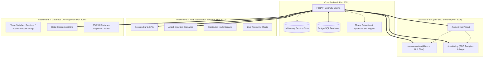

# 🌌 Quantum Digital Signature (QDS) Platform: Complete UI & Architecture Specification

This document provides a comprehensive technical blueprint of all three user-facing dashboards, their component breakdowns, routes, quantum cryptographic principles, telemetry flows, API contracts, and interactive capabilities.

---

## 🏛️ 1. High-Level Tri-Dashboard Architecture

---

## 🛡️ 2. Dashboard 1: Cyber-SOC Sentinel Console (`q-email`, Port 3000)

The primary defense operations cockpit designed for cybersecurity analysts, network operators, and quantum cryptographers.

### Route 1: `/home` — Landing Hub Portal
- **Purpose**: High-level switchboard that isolates the visual quantum physics demonstration from production monitoring operations.
- **Components & Features**:
  1. **Top Header**: System title (`QDS SENTINEL`), version badge (`v1.0.0`), API Gateway connection status (`3001 OK`), and live ping latency in ms.
  2. **Quantum Protocol Demonstration Card (`/demonstration`)**:
     - Direct CTA button to launch the Alice ↔ Bob visual simulator.
     - Feature badges: *EPR Entangled Pairs, Alice Joint BSM, Bob Pauli Rotations, CHSH Bell Test*.
  3. **SOC Security Monitoring Card (`/monitoring`)**:
     - Direct CTA button to enter the security telemetry and threat investigation center.
     - Feature badges: *Telemetry Audit Stream, Hoeffding Thresholds, Session Database, Threat Quarantine*.
  4. **Cluster Status Strip**: Active session ID (`QKD-YYYYMMDD-XXXX`), network operational state, connected nodes, and channel types.

---

### Route 2: `/demonstration` — Alice ↔ Bob Quantum Protocol Visualizer
- **Purpose**: An interactive visual physics simulator demonstrating how an authenticated digital signature is generated and validated using entangled photons and classical feed-forward corrections.
- **Components & Features**:
  1. **Interactive Navigation Header**:
     - `← Home Portal` back button.
     - Session identity display.
     - Fast-switch button to `SOC Monitoring Center →`.
  2. **Simulator Control Bar**:
     - **Play Flow / Pause**: Toggles automatic sequential execution of protocol steps (2.5s interval).
     - **Next Step**: Advances one phase forward.
     - **Reset**: Restores simulation to Step 1.
     - **Execute Live Run**: Executes a real simulation against the FastAPI backend (`POST /api/v1/sessions/run-workflow`).
  3. **6-Phase Step Tracker**:
     - **Step 1: EPR Pair Distribution** (Arbitrator distributes entangled Bell pairs $|\Phi^+\rangle = \frac{|00\rangle+|11\rangle}{\sqrt{2}}$).
     - **Step 2: Alice Bell Measurement** (Alice performs joint BSM on document state and entangled qubit in random bases $\{Z, X\}$).
     - **Step 3: Feed-Forward Transmission** (Alice sends 2 classical bits $(b_1, b_2) \in \{00, 01, 10, 11\}$ to Bob).
     - **Step 4: Bob Pauli Frame Rotation** (Bob applies local unitary correction $\sigma_I, \sigma_X, \sigma_Z, \sigma_{XZ}$ based on $(b_1, b_2)$).
     - **Step 5: Basis Reconciliation** (Alice and Bob publish basis choices, keeping matches and discarding mismatches).
     - **Step 6: Hoeffding & CHSH Audit** (Deterministic decision gate: $\text{QBER} \le 5.5\%$, $\text{CHSH} \ge 2.0$).
  4. **Animated Optical Channel Canvas**:
     - **Alice Node**: Document hash display, BSM basis selector, generated classical feed-forward bits.
     - **Arbitrator Node**: Entangled photon pair emitter.
     - **Animated Photon Stream**: Moving wavepacket ($\gamma$) traversing the optical fiber.
     - **Eve Interception Toggle**: Interactive 35% Man-in-the-Middle eavesdropping switch. When active, photon turns red, Bell correlation breaks ($S < 2.0$), QBER spikes ($\sim 14.2\%$), and decision switches to `REJECT`.
     - **Bob Node**: Received Pauli correction indicator, basis dial, and corrected bit value.
  5. **Quantum Bitstream & Pauli Alignment Matrix**:
     - 16-pulse sample table comparing Alice's basis, raw bits, Bell outcomes, Bob's basis, applied Pauli corrections, and `KEPT`/`DROP` sifting statuses.

---

### Route 3: `/monitoring` — SOC Security Monitoring & Analytics Center
- **Purpose**: Deep forensic telemetry, live incident logging, and statistical boundary tracking.
- **Internal Subdirectories & Tabs**:
  1. **SOC Overview & Logs (`overview`)**:
     - **Threat Alert Banner**: Displays threat category, severity (`CRITICAL`, `HIGH`, `MEDIUM`), and root-cause details if a session is attacked.
     - **6-Card KPI Grid**:
       - *Active Sessions*: Total count of active sessions.
       - *Verified Signatures*: Total authentic sessions confirmed.
       - *Security Score*: Real-time confidence score ($0-100\%$).
       - *Total Optical Pulses*: Total EPR photon pairs generated.
       - *Bit Error Rate (QBER)*: Observed error rate vs baseline.
       - *API Latency*: FastAPI gateway round-trip time.
     - **Statistical Boundary Charts**:
       - *Hoeffding Statistical Bound Analysis*: Observed QBER line vs Hoeffding threshold ceiling ($T = e_0 + \Delta$).
       - *CHSH Bell Non-Locality Line Chart*: Observed S-score vs Classical Bound ($S = 2.000$) and Tsirelson Bound ($S = 2.828$).
     - **Live Telemetry Stream Table**: Live streaming events with timestamp, subsystem badge (`QUANTUM_CORE`, `THREAT_ENGINE`, `ALICE`, `BOB`, `ARBITRATOR`), latency in ms, HTTP status code, message, and copy log JSON button.
  2. **Threats & Bounds (`threats`)**:
     - 4 Core Security Metric Tiles (Observed QBER, Hoeffding Bound, CHSH S-Score, Security Verdict).
     - Deep Hoeffding formula audit ($N$ sifted sample size, $\alpha = 10^{-6}$ false alarm probability, $\Delta$ confidence interval).
     - Decision Matrix: Bitwise XOR mismatch check, Hoeffding test, Bell test, and Pauli alignment check.
  3. **Security Investigations (`incidents`)**:
     - Quarantined threat records with search bar, severity filter pills, and forensic evidence inspection drawer.
  4. **Session Explorer (`sessions`)**:
     - Database table of all sessions with live QBER, CHSH scores, status badges, and raw telemetry inspector.
  5. **Quantum Network (`network`)**:
     - Distributed node topology SVG diagram showing dark-fiber quantum optical links and classical authenticated channels for Alice, Bob, Arbitrator, and Eve.

---

## ⚔️ 3. Dashboard 2: Red Team Attack Sandbox (`frontend`, Port 5173)

An offensive quantum adversary simulation environment designed to inject cyber-physical quantum attacks and observe defenses in real time.

### Key Sections & Features:
1. **Active Session Identity & Parameter Bar**:
   - Displays Active Session (`QKD-YYYYMMDD-XXXX`), Protocol Phase (`AUTHENTICATED`, `AUDITED`, `MEASURED`, `SIFTED`), and Reset button.
2. **Interactive Attack Injection Scenarios**:
   - **Scenario 1: Clean Authentic Signature**: Runs an undisturbed protocol execution (100 EPR pairs, 0% Eve, Verdict: `ACCEPT`, QBER $\approx 0.0-1.8\%$, CHSH $\approx 2.78$).
   - **Scenario 2: Intercept-Resend (MitM) Attack**: Eve intercepts 35% of photons, measures in random bases, and resends. Causes basis collapse, driving QBER to $\sim 14-25\%$ and violating the Hoeffding bound $\rightarrow$ `REJECT`.
   - **Scenario 3: Signature Forgery Attack**: Eve tampers with classical feed-forward bits $(b_1, b_2)$ in transit. Forces Bob to apply wrong Pauli frame corrections $\rightarrow$ high XOR mismatches $\rightarrow$ `REJECT`.
   - **Scenario 4: Replay Attack**: Eve re-transmits a captured previous quantum session signature. Blocked by session nonce replay detection $\rightarrow$ `BLOCKED`.
   - **Scenario 5: Environmental Channel Noise**: Simulates thermal depolarization / phase drift.
   - **Scenario 6: Photon-Number-Splitting (PNS)**: Simulates multi-photon pulse splitting on imperfect laser sources.
3. **Real-Time Distributed Node Terminal Streams**:
   - 4 live terminal feeds simultaneously logging activity across `ARBITRATOR`, `ALICE (Node A)`, `BOB (Node B)`, and `EVE (Adversary)`.
4. **Telemetry & Statistical Visualizer**:
   - Observed QBER vs Dynamic Hoeffding Boundary graph.
   - CHSH Bell inequality violation graph ($S \ge 2.0$ quantum state vs $S < 2.0$ collapsed classical state).
   - Real-time Threat Alarm Modal displaying quarantined attack signatures.

---

## 🗄️ 4. Dashboard 3: Database Live Inspector & Studio (`db-dashboard`, Port 4000)

A native database studio (TablePlus/pgAdmin style) for inspecting session states, raw quantum bit arrays, Pauli corrections, and system audit logs.

### Key Sections & Features:
1. **Left Table Sidebar**:
   - Quick navigation between tables: `quantum_sessions`, `attack_records`, `node_metrics`, `telemetry_logs`.
   - Live row count badges.
2. **Top Action Toolbar**:
   - Table name and live sync status (`Auto-sync every 2.5s`).
   - Global Search input (filter by Session ID, Status, Verdict, or Threat Type).
   - Status Filter pills (`ALL`, `ACCEPT`, `REJECT`, `PENDING`).
   - `+ Insert Record` modal: Quickly seeds realistic quantum test sessions directly into the database.
   - `Refresh` button.
3. **Data Spreadsheet Grid**:
   - High-density tabular view with columns: Session ID, Document Name, Status, QBER, Hoeffding Bound, CHSH Score, Verdict Badge, Attacks Count, and Created Timestamp.
4. **JSONB Bitstream & Record Drawer**:
   - Clicking any row opens a slide-over inspection drawer.
   - Displays raw JSONB payloads: Alice's raw bits ($[1, 0, 1, 1, ...]$), Bell measurement bit pairs ($["01", "00", "11", ...]$), Bob's measurements, Pauli correction operators ($["I", "X", "Z", "XZ", ...]$), and XOR mismatch arrays.

---

## 📐 5. Quantum Cryptographic Equations & Physical Meaning

| Metric / Parameter | Mathematical Formula | Physical & Cryptographic Meaning | Normal Range | Attack Threshold |
| :--- | :--- | :--- | :--- | :--- |
| **QBER (Quantum Bit Error Rate)** | $e = \frac{\sum (A_i \oplus B_i)}{N_{\text{sifted}}}$ | Ratio of mismatched sifted bits between Alice and Bob. Measures channel disturbance. | $0.0\% - 2.0\%$ | $> 5.5\%$ (Auto Reject) |
| **Hoeffding Statistical Bound** | $\Delta = \sqrt{\frac{\ln(2/\alpha)}{2N}}, \quad T = e_0 + \Delta$ | Statistically rigorous confidence threshold distinguishing natural thermal noise ($e_0$) from active eavesdropping at significance level $\alpha = 10^{-6}$. | $T \approx 3.5\% - 5.5\%$ | Observed QBER $> T$ |
| **CHSH Bell Score ($S$)** | $S = E(a,b) - E(a,b') + E(a',b) + E(a',b')$ | Quantifies quantum non-locality and entanglement integrity across measurement angles. | $2.60 - 2.82$ (Tsirelson Bound: $2\sqrt{2} \approx 2.828$) | $S < 2.00$ (Classical Eavesdropped Regime) |
| **Pauli Frame Unitaries** | $\sigma_I, \sigma_X, \sigma_Z, \sigma_{XZ}$ | Rotational corrections applied by Bob based on Alice's classical 2-bit Bell measurement outcome $(b_1, b_2) \in \{00, 01, 10, 11\}$. | Deterministic Map | Random if Forged |

---

## 🌐 6. Unified Data Contracts & API Endpoints

All three dashboards communicate with the shared FastAPI Gateway (`http://127.0.0.1:3001`):

| Endpoint | Method | Purpose | Consumed By |
| :--- | :--- | :--- | :--- |
| `/api/v1/arbitrator/sessions` | `GET` | Lists all active and historical quantum sessions | Dashboards 1, 2, 3 |
| `/api/v1/sessions/run-workflow` | `POST` | Executes complete end-to-end QDS signature protocol | Dashboards 1, 2 |
| `/api/v1/security/threshold-audit` | `POST` | Evaluates deterministic XOR, QBER, Hoeffding, and CHSH gate | Dashboards 1, 2, 3 |
| `/api/v1/attacks/intercept-resend` | `POST` | Injects Man-in-the-Middle eavesdropping disturbance | Dashboards 1, 2 |
| `/api/v1/attacks/forgery` | `POST` | Injects classical feed-forward tampering attack | Dashboards 1, 2 |
| `/api/v1/attacks/replay` | `POST` | Attempts to replay previously used quantum signature | Dashboards 1, 2 |
| `/api/v1/sessions/telemetry/recent` | `GET` | Fetches real-time log ring-buffer events | Dashboards 1, 2, 3 |
| `/api/v1/db/sessions` | `GET` | Fetches full database table records with pagination | Dashboard 3 |
| `/api/v1/db/stats` | `GET` | Fetches aggregated counts for sessions, attacks, and logs | Dashboard 3 |
| `/api/v1/nodes` | `GET` | Returns status and latency of all distributed quantum nodes | Dashboards 1, 2, 3 |
