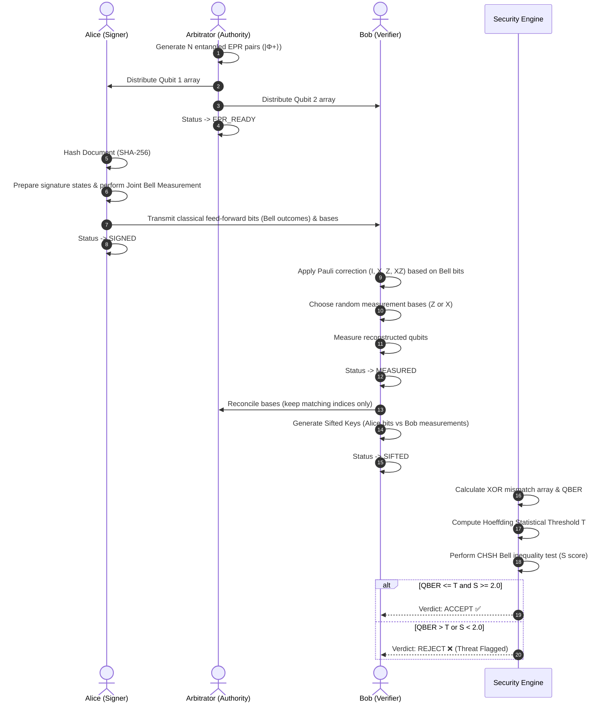
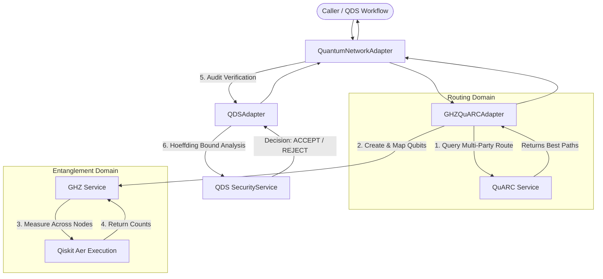

# Quantum Digital Signature (QDS) — Quantum-Inspired Cyber Threat Detection Backend

> **SIH 2026 — Problem Statement ID 26141**  
> **Quantum-Inspired Cyber Threat Detection for Digital Signature Security**  
> *Distributed Node Architecture with Standalone GHZ Entanglement & QuARC Adaptive Routing Engines*

---

## 1. Project Overview and Objectives

The **QDS (Quantum Digital Signature)** backend is a distributed, quantum-inspired cyber threat detection and digital signature verification framework. It combines simulated quantum optical protocols (Bell-state teleportation, multipartite GHZ entanglement) with deterministic, non-AI statistical security verification (Hoeffding-Chernoff statistical bounds, CHSH Bell inequality tests) to detect eavesdropping, tampering, forgery, and channel degradation in real time.

### Core Objectives
1. **Distributed Node Architecture**: Model Alice (Signer), Bob (Verifier), and Arbitrator (Trusted Authority) as independent logical nodes communicating via REST/JSON APIs.
2. **Statistical Threat Detection**: Provide explainable, deterministic security gating based on Quantum Bit Error Rate (QBER), Hoeffding confidence intervals, and CHSH Bell inequality violation without black-box ML.
3. **Attack Sandbox**: Provide red-team simulation endpoints for Intercept-Resend (MitM), Signature Forgery, Replay, Depolarizing Channel Noise, and Photon Number Splitting (PNS) attacks.
4. **Standalone GHZ Entanglement Engine**: Generate genuine 3-qubit Greenberger-Horne-Zeilinger (GHZ) quantum states using Qiskit, distribute among 3 parties, measure across arbitrary bases ($Z$ and $X$), and verify parity correlations.
5. **Standalone QuARC Adaptive Routing Engine**: Implement Quantum Adaptive Routing using Clusters (QuARC) over quantum network topologies using multi-metric path evaluation (fidelity, latency, reliability, bottleneck capacity), adaptive constraint selection, and dynamic loop-free rerouting.
6. **Decoupled Integration Layer**: Provide non-invasive adapters bridging GHZ and QuARC to the existing QDS security architecture without refactoring stable signature logic.

---

## 2. Complete Architecture & Directory Structure

### High-Level Subsystem Architecture

```
                               ┌────────────────────────────────────────────────────────┐
                               │                    FastAPI Layer                       │
                               │  /api/v1/alice  /api/v1/bob  /api/v1/arbitrator        │
                               │  /api/v1/security  /api/v1/attacks  /api/v1/sessions   │
                               │  /api/v1/ghz  /api/v1/quarc  /api/v1/network           │
                               └───────────┬────────────────────────────────┬───────────┘
                                           │                                │
                 ┌─────────────────────────┴───────────────┐                │
                 ▼                                         ▼                ▼
┌─────────────────────────────────┐       ┌─────────────────────────────────────────────────┐
│     Existing QDS Foundation     │       │                Integration Layer                │
│                                 │       │                                                 │
│ • QuantumService (EPR Stub)     │       │ • GHZQuARCAdapter (Multi-party Route & GHZ)     │
│ • SecurityService (QBER/CHSH)   │◄──────┤ • QuantumNetworkAdapter (Session Pipeline)      │
│ • AttackService (5 Sandbox)     │       │ • QDSAdapter (Hoeffding Audit Bridge)           │
│ • SessionService (Lifecycle)    │       └──────────────┬───────────────────┬──────────────┘
└─────────────────────────────────┘                      │                   │
                                                         ▼                   ▼
                                          ┌────────────────────────┐  ┌────────────────────────┐
                                          │       GHZ Module       │  │      QuARC Module      │
                                          │      (Standalone)      │  │      (Standalone)      │
                                          │                        │  │                        │
                                          │ • 3-Qubit Circuit      │  │ • QuantumTopology      │
                                          │ • Qiskit Aer Engine    │  │ • ClusterManager       │
                                          │ • 3-Party Distribution │  │ • MetricsEvaluator     │
                                          │ • Z/X Measurement      │  │ • CandidatePathFinder  │
                                          │ • Parity Verification  │  │ • AdaptiveSelector     │
                                          │ • GHZ QBER             │  │ • ReroutingEngine      │
                                          └────────────────────────┘  └────────────────────────┘
```

### Complete Codebase Layout

```text
c:/Users/HP/Documents/QDS/
├── MASTER_SPEC.md                # Full SIH 26141 Master Engineering Specification
├── README.md                     # Comprehensive backend documentation (this file)
└── backend/
    ├── requirements.txt          # Python dependencies
    ├── app/
    │   ├── __init__.py
    │   ├── main.py               # FastAPI application entrypoint, lifespan & router mounting
    │   ├── api/                  # Thin FastAPI route controllers
    │   │   ├── __init__.py
    │   │   ├── alice.py          # /api/v1/alice (Document signing & state inspection)
    │   │   ├── arbitrator.py     # /api/v1/arbitrator (EPR distribution & session oversight)
    │   │   ├── attacks.py        # /api/v1/attacks (Red-team attack injection sandbox)
    │   │   ├── bob.py            # /api/v1/bob (Pauli correction, measurement & sifting)
    │   │   ├── security.py       # /api/v1/security (QBER, Hoeffding, CHSH, Threshold Audit)
    │   │   ├── sessions.py       # /api/v1/sessions (Session retrieval & lifecycle reset)
    │   │   ├── ghz.py            # /api/v1/ghz (GHZ creation, distribution, measurement, verify)
    │   │   ├── quarc.py          # /api/v1/quarc (Route selection, rerouting, clusters)
    │   │   └── network.py        # /api/v1/network (Nodes, links & topology management)
    │   │
    │   ├── core/                 # Framework infrastructure
    │   │   ├── __init__.py
    │   │   ├── config.py         # Pydantic Settings, environment variables & defaults
    │   │   ├── database.py       # Async SQLAlchemy engine, session maker & SQLite fallback
    │   │   ├── exceptions.py     # Custom exceptions & global FastAPI exception handlers
    │   │   └── middleware.py     # Request tracing & non-blocking telemetry logging
    │   │
    │   ├── models/               # Database ORM entity models
    │   │   ├── __init__.py
    │   │   └── db_models.py      # SQLAlchemy Base models for Sessions, Telemetry, GHZ, QuARC
    │   │
    │   ├── schemas/              # Pydantic v2 request/response validation schemas
    │   │   ├── __init__.py
    │   │   ├── common.py         # ErrorResponse, HealthResponse, StandardResponse
    │   │   ├── session.py        # QuantumSession, AliceData, BobData, SecurityResult
    │   │   ├── quantum.py        # EPR, Sign, Verify, Sift request/response schemas
    │   │   ├── security.py       # QBER, Threshold, CHSH, Audit schemas
    │   │   ├── attack.py         # Attack injection request/response schemas
    │   │   ├── ghz.py            # GHZ create, distribute, measure, verify schemas
    │   │   ├── quarc.py          # Route, reroute, cluster, candidate schemas
    │   │   └── network.py        # Node, link, topology management schemas
    │   │
    │   ├── services/             # Core business logic for QDS workflow
    │   │   ├── __init__.py
    │   │   ├── session_service.py # In-memory session registry with async DB persistence
    │   │   ├── quantum_service.py # 2-party EPR preparation, Bell measurement, sifting
    │   │   ├── security_service.py# Deterministic QBER, Hoeffding threshold & CHSH
    │   │   └── attack_service.py  # Attack simulation engine (5 distinct threat vectors)
    │   │
    │   ├── ghz/                  # Standalone 3-Qubit GHZ Entanglement Package
    │   │   ├── __init__.py
    │   │   ├── circuit.py        # Qiskit circuit builder & AerSimulator execution
    │   │   ├── state.py          # GHZState dataclass & lifecycle representation
    │   │   ├── distribution.py   # 3-party validation & qubit allocation (q0, q1, q2)
    │   │   ├── measurement.py    # Multi-basis quantum measurement engine (Z & X)
    │   │   ├── verification.py   # Derived parity statistics, QBER & decision rules
    │   │   ├── models.py         # Domain models, enums & measurement dataclasses
    │   │   ├── exceptions.py     # GHZ module exceptions
    │   │   └── service.py        # GHZService public facade
    │   │
    │   ├── quarc/                # Standalone QuARC Quantum Adaptive Routing Package
    │   │   ├── __init__.py
    │   │   ├── node.py           # QuantumNode entity (CLIENT, ROUTER, REPEATER, ARBITRATOR)
    │   │   ├── link.py           # QuantumLink entity (fidelity, latency, reliability, capacity)
    │   │   ├── topology.py       # QuantumTopology graph abstraction & DFS path finder
    │   │   ├── cluster.py        # ClusterManager for quality-based network partitioning
    │   │   ├── metrics.py        # Multi-metric path evaluator & composite scoring formula
    │   │   ├── path.py           # Candidate path discovery & constraint ranking
    │   │   ├── selector.py       # AdaptivePathSelector returning explainable decisions
    │   │   ├── rerouting.py      # ReroutingEngine with failure detection & loop prevention
    │   │   ├── models.py         # Domain models, enums, constraints & event logs
    │   │   ├── exceptions.py     # QuARC module exceptions
    │   │   └── service.py        # QuARCService public facade
    │   │
    │   └── integration/          # Decoupled Integration & Adapter Layer
    │       ├── __init__.py
    │       ├── ghz_quarc_adapter.py      # Multi-party routing to GHZ state establishment
    │       ├── quantum_network_adapter.py# End-to-end quantum session pipeline
    │       └── qds_adapter.py            # Bridge from GHZ/QuARC to QDS security audit
    │
    └── tests/                    # Pytest test suite (60 tests total)
        ├── conftest.py           # Shared fixtures (TestClient, async sessions)
        ├── test_alice.py         # Alice signing & state endpoints
        ├── test_arbitrator.py    # EPR distribution & session management
        ├── test_attacks.py       # Red-team attack injection & security reactions
        ├── test_bob.py           # Bob Pauli correction, measurement & sifting
        ├── test_security.py      # QBER, Hoeffding, CHSH & Audit endpoints
        ├── test_sessions.py      # Session lifecycle & reset endpoints
        ├── test_ghz.py           # Standalone GHZ circuit, basis & verification tests
        ├── test_quarc.py         # Standalone QuARC topology, metrics & reroute tests
        ├── test_integration.py   # Integration adapter pipeline tests
        └── test_e2e_ghz_quarc.py # Full E2E network + dynamic rerouting demonstration
```

---

## 3. Existing QDS Protocol (Alice / Bob / Arbitrator)

The standard QDS workflow operates as a 5-step sequence across independent logical nodes:



### Protocol Steps

1. **EPR Pair Distribution (`/api/v1/arbitrator/epr-distribute`)**:
   Arbitrator generates $N$ entangled Bell pairs $|\Phi^+\rangle = (|00\rangle + |11\rangle)/\sqrt{2}$, routing qubit 1 to Alice and qubit 2 to Bob.
2. **Alice Signing (`/api/v1/alice/sign`)**:
   Alice converts the document hash into a binary key, selects random preparation bases ($Z$ or $X$), prepares signature quantum states, performs Joint Bell Measurement, and publishes classical feed-forward bits.
3. **Bob Verification (`/api/v1/bob/verify`)**:
   Bob applies Pauli corrections based on Alice's Bell bits ($00 \to I, 01 \to X, 10 \to Z, 11 \to XZ$), chooses random measurement bases, and measures the corrected qubits.
4. **Basis Sifting (`/api/v1/bob/sift`)**:
   Compares Alice's preparation bases with Bob's measurement bases, discarding mismatches (typically $\sim 50\%$ discard rate) to form synchronized sifted bitstrings.
5. **Deterministic Security Audit (`/api/v1/security/threshold-audit`)**:
   Runs XOR bit comparisons, derives observed QBER, evaluates against the Hoeffding threshold $T$, and evaluates CHSH Bell test value $S$. If all pass, the signature is accepted.

---

## 4. Quantum Implementation, QBER & Statistical Security

### Quantum Bit Error Rate (QBER)
For Alice's sifted bits $A$ and Bob's sifted bits $B$ of length $N$:
$$\text{QBER} = \frac{\sum_{i=1}^N (A[i] \oplus B[i])}{N}$$

### Corrected Hoeffding-Chernoff Statistical Threshold
To distinguish natural channel noise from eavesdropping disturbance with a target false-alarm probability $\alpha$ (default $\alpha = 10^{-6}$):
$$\Delta = \sqrt{\frac{\ln(2/\alpha)}{2N}}$$
$$\text{Threshold } T = e_0 + \Delta$$
where $e_0$ is the baseline channel noise (default $e_0 = 0.02$, or $2\%$).
- **Rule**: If $\text{QBER} \le T$, the variation is statistically consistent with natural noise $\to$ **PASS**.
- **Rule**: If $\text{QBER} > T$, excess disturbance is detected $\to$ **REJECT** with `CRITICAL` or `HIGH` severity.

### CHSH Bell Inequality Test
Quantifies quantum entanglement persistence via correlation expectations across complementary measurement angles:
$$S = |E(a, b) - E(a, b') + E(a', b) + E(a', b')|$$
- **Classical Upper Bound**: $S \le 2.0$
- **Quantum Tsirelson's Bound**: $S = 2\sqrt{2} \approx 2.8284$
- **Evaluation Gate**:
  - $S \ge 2.4 \implies \text{ENTANGLEMENT\_PRESENT}$
  - $2.0 \le S < 2.4 \implies \text{CORRELATION\_DEGRADED}$
  - $S < 2.0 \implies \text{BELL\_VIOLATION\_FAILED}$ (Triggers threat rejection)

---

## 5. Standalone GHZ Quantum Entanglement Module

The `app.ghz` package provides a fully independent, simulated quantum-circuit engine for 3-qubit Greenberger-Horne-Zeilinger states.

### State Preparation
Constructs a genuine 3-qubit circuit in Qiskit:
$$|\text{GHZ}\rangle = \frac{|000\rangle + |111\rangle}{\sqrt{2}}$$

```text
q0: ──H────■──────────────[Basis Rot]──■──
           │                           │
q1: ───────X────■─────────[Basis Rot]──┼──■──
                │                      │  │
q2: ────────────X─────────[Basis Rot]──┼──┼──■
                                       │  │  │
c:  ═══════════════════════════════════0══1══2
```

### Measurement Bases & Mathematical Parity Rules

1. **Computational $Z$-Basis (`['Z', 'Z', 'Z']`)**:
   - Used for correlated raw bit extraction.
   - **Theoretical Outcomes**: $|000\rangle$ (50%) and $|111\rangle$ (50%).
   - **Error Condition**: Any outcome where participants disagree ($001, 010, 011, 100, 101, 110$).

2. **Transverse $X$-Basis (`['X', 'X', 'X']`)**:
   - Applying Hadamard gate $H$ on all 3 qubits prior to measurement rotates $\{|+\rangle, |-\rangle\}$ eigenstates into computational basis $\{|0\rangle, |1\rangle\}$.
   - Mathematical expansion:
     $$H^{\otimes 3} |\text{GHZ}\rangle = \frac{1}{2} \left( |000\rangle + |011\rangle + |101\rangle + |110\rangle \right)$$
   - **Parity Condition**: All valid outcomes have **EVEN PARITY** ($b_0 \oplus b_1 \oplus b_2 = 0$).
   - **Error Condition**: Any odd parity outcome ($001, 010, 100, 111$) indicates eavesdropping or channel decoherence.

### Standalone Python Usage Example
```python
from app.ghz.service import GHZService

ghz = GHZService()

# 1. Create and distribute state
state = ghz.create_state(participants=["alice", "bob", "charlie"], shots=1000)

# 2. Measure in transverse X-basis
measurement = ghz.measure(state, basis=["X", "X", "X"])

# 3. Mathematically verify parity
verification = ghz.verify(measurement, threshold=0.05)

print(f"Verified: {verification.verified}")
print(f"Parity Passed: {verification.parity_passed}")
print(f"QBER: {verification.qber}")
```

---

## 6. Standalone QuARC Quantum Adaptive Routing Module

The `app.quarc` package implements **Quantum Adaptive Routing using Clusters (QuARC)**.

### Engineering Model
QuARC provides topology graph modeling, clustering, candidate path generation, multi-metric evaluation, constraint filtering, and loop-free failure rerouting.

### Quantitative Path Scoring Formula
For candidate path $P$ with hop count $H = |P| - 1$:
- **End-to-End Fidelity**: $F_{\text{e2e}} = \prod_{i=1}^H F_i$
- **Total Latency**: $L_{\text{total}} = \sum_{i=1}^H \text{Latency}_i$
- **Overall Reliability**: $R = \prod_{i=1}^H p_{\text{succ}, i} \cdot (1 - e_i)$
- **Bottleneck Capacity**: $C_{\text{min}} = \min_{i=1}^H \text{Capacity}_i$
- **Average Error Rate**: $\bar{e} = \frac{1}{H} \sum_{i=1}^H e_i$

**Explicit Composite Score**:
$$\text{Score} = w_{\text{fid}} \cdot F_{\text{e2e}} + w_{\text{rel}} \cdot R - w_{\text{lat}} \cdot \min\left(1.0, \frac{L_{\text{total}}}{50.0}\right) - w_{\text{hops}} \cdot \min\left(1.0, \frac{H}{10.0}\right)$$
*Default Weights: $w_{\text{fid}} = 0.40, w_{\text{rel}} = 0.30, w_{\text{lat}} = 0.20, w_{\text{hops}} = 0.10$.*

### Dynamic Failure Detection & Loop-Free Rerouting
```text
Link/Node Failure Detected
           │
           ▼
Mark Link FAILED / Node OFFLINE in Topology
           │
           ▼
Add Failed Path to Blacklist History (Prevents Reselection)
           │
           ▼
Execute DFS Path Search on Active Elements
           │
           ▼
Evaluate Multi-Metric Constraints on Alternative Candidates
           │
           ▼
Select Optimal Backup Route (Explainable Decision Record)
```

### Standalone Python Usage Example
```python
from app.quarc.service import QuARCService
from app.quarc.models import NodeType

quarc = QuARCService()

# 1. Build network
quarc.add_node("alice", node_type=NodeType.CLIENT)
quarc.add_node("bob", node_type=NodeType.CLIENT)
quarc.add_node("node1", node_type=NodeType.ROUTER)
quarc.add_link("l1", "alice", "node1", fidelity=0.99, latency=2.0)
quarc.add_link("l2", "node1", "bob", fidelity=0.99, latency=2.0)

# 2. Select optimal route
decision = quarc.select_route("alice", "bob")
print(f"Selected: {decision.selected_path}, Score: {decision.score}")

# 3. Simulate link disruption & adaptive reroute
quarc.rerouter.mark_link_failed("node1", "bob")
# quarc.reroute("alice", "bob", failed_path=decision.selected_path)
```

---

## 7. Decoupled Integration Layer

The `app.integration` package acts as a clean bridge between QuARC routing, GHZ entanglement, and QDS security checks.



---

## 8. Complete API Endpoint Reference (34 Endpoints)

All endpoints are versioned under `/api/v1` and documented via OpenAPI Swagger at `http://localhost:8000/docs`.

### Arbitrator Endpoints
| Method | Endpoint | Description | Request Body |
|---|---|---|---|
| `POST` | `/api/v1/arbitrator/epr-distribute` | Generate EPR pairs & initialize session | `{"num_pairs": 1000, "baseline_noise": 0.02, "alpha": 1e-6}` |
| `GET` | `/api/v1/arbitrator/session/{session_id}` | Retrieve complete session state | N/A |
| `GET` | `/api/v1/arbitrator/sessions` | List all active quantum sessions | N/A |

### Alice (Signer) Endpoints
| Method | Endpoint | Description | Request Body |
|---|---|---|---|
| `POST` | `/api/v1/alice/sign` | Sign document using quantum Bell measurement | `{"session_id": "...", "document": "Contract text"}` |
| `GET` | `/api/v1/alice/state/{session_id}` | Inspect Alice's state and signature keys | N/A |

### Bob (Verifier) Endpoints
| Method | Endpoint | Description | Request Body |
|---|---|---|---|
| `POST` | `/api/v1/bob/verify` | Apply Pauli correction & measure qubits | `{"session_id": "..."}` |
| `POST` | `/api/v1/bob/sift` | Perform basis sifting / reconciliation | `{"session_id": "..."}` |
| `GET` | `/api/v1/bob/state/{session_id}` | Inspect Bob's measurement results | N/A |

### Security Endpoints
| Method | Endpoint | Description | Request Body |
|---|---|---|---|
| `POST` | `/api/v1/security/threshold-audit` | **Full security audit** (QBER + Hoeffding + CHSH) | `{"session_id": "..."}` |
| `POST` | `/api/v1/security/qber` | Standalone QBER calculation | `{"alice_bits": [0,1,...], "bob_bits": [0,1,...]}` |
| `POST` | `/api/v1/security/threshold` | Standalone Hoeffding threshold derivation | `{"sample_size": 500, "baseline_qber": 0.02, "alpha": 1e-6}` |
| `POST` | `/api/v1/security/chsh` | Standalone CHSH Bell inequality test | `{"E_ab": 0.70, "E_ab_prime": -0.70, ...}` |

### Attacks Sandbox (Red Team) Endpoints
| Method | Endpoint | Description | Request Body |
|---|---|---|---|
| `POST` | `/api/v1/attacks/intercept-resend` | Inject Man-in-the-Middle eavesdropping | `{"session_id": "...", "attack_fraction": 0.50, "basis_strategy": "RANDOM"}` |
| `POST` | `/api/v1/attacks/forgery` | Inject signature forgery attack | `{"session_id": "...", "forgery_type": "MESSAGE_MODIFICATION"}` |
| `POST` | `/api/v1/attacks/replay` | Inject replay attack with stale state | `{"session_id": "...", "target_session_id": "..."}` |
| `POST` | `/api/v1/attacks/noise` | Inject depolarizing channel noise | `{"session_id": "...", "noise_rate": 0.15}` |
| `POST` | `/api/v1/attacks/pns` | Inject Photon Number Splitting attack | `{"session_id": "...", "split_fraction": 0.30}` |

### GHZ Quantum Entanglement Endpoints
| Method | Endpoint | Description | Request Body |
|---|---|---|---|
| `POST` | `/api/v1/ghz/create` | Create 3-qubit GHZ state instance | `{"participants": ["alice", "bob", "charlie"], "shots": 1000}` |
| `POST` | `/api/v1/ghz/distribute` | Distribute state to 3 participants | `{"ghz_id": "...", "participants": ["a", "b", "c"]}` |
| `POST` | `/api/v1/ghz/measure` | Run Qiskit simulation in Z or X basis | `{"ghz_id": "...", "basis": ["X", "X", "X"]}` |
| `POST` | `/api/v1/ghz/verify` | Verify parity, compute QBER & verdict | `{"ghz_id": "...", "threshold": 0.05}` |
| `GET` | `/api/v1/ghz/{ghz_id}` | Retrieve GHZ state details | N/A |

### QuARC Quantum Routing Endpoints
| Method | Endpoint | Description | Request Body |
|---|---|---|---|
| `POST` | `/api/v1/quarc/route` | Adaptive path selection under constraints | `{"source": "alice", "destination": "bob", "constraints": {...}}` |
| `POST` | `/api/v1/quarc/reroute` | Adaptive rerouting avoiding failed path | `{"source": "a", "destination": "b", "failed_path": [...]}` |
| `GET` | `/api/v1/quarc/clusters` | Retrieve clustered network components | Query params: `fidelity_threshold`, `max_latency` |

### Quantum Network Topology Endpoints
| Method | Endpoint | Description | Request Body |
|---|---|---|---|
| `POST` | `/api/v1/network/nodes` | Register a quantum node | `{"node_id": "node1", "node_type": "ROUTER", "capacity": 100}` |
| `GET` | `/api/v1/network/nodes` | List all registered quantum nodes | N/A |
| `GET` | `/api/v1/network/nodes/{node_id}` | Get single node details | N/A |
| `POST` | `/api/v1/network/links` | Register a quantum link | `{"link_id": "l1", "source": "a", "destination": "b", "fidelity": 0.99}` |
| `GET` | `/api/v1/network/topology` | Export complete network graph | N/A |

### System & Telemetry Endpoints
| Method | Endpoint | Description | Request Body |
|---|---|---|---|
| `GET` | `/health` | System health check & active metrics | N/A |
| `GET` | `/api/v1/sessions/` | List all sessions with parameters | N/A |
| `GET` | `/api/v1/sessions/{session_id}` | Retrieve full session details | N/A |
| `POST` | `/api/v1/sessions/{session_id}/reset` | Reset a session to initial state | N/A |
| `GET` | `/api/v1/telemetry/` | Retrieve API execution telemetry logs | N/A |

---

## 9. Dependencies, Installation & Configuration

### Prerequisites
- **Python**: 3.11+ (Tested on Python 3.13.7)
- **PostgreSQL** (Optional — automatically falls back to in-memory SQLite if PostgreSQL is unavailable)

### Key Python Packages
```text
fastapi==0.115.12
uvicorn[standard]==0.34.2
pydantic==2.11.3 / pydantic-settings==2.9.1
qiskit==2.2.3
qiskit-aer==0.17.2
numpy==2.2.6
scipy==1.16.2
sqlalchemy==2.0.38
asyncpg==0.31.0
aiosqlite==0.22.1
pytest==8.3.5 / pytest-asyncio==0.25.3
```

### Installation

```bash
# 1. Navigate to backend directory
cd backend

# 2. Install dependencies
pip install -r requirements.txt
```

### Configuration (`app/core/config.py` / `.env`)
| Variable | Default | Description |
|---|---|---|
| `API_PREFIX` | `/api/v1` | Root API route prefix |
| `DEFAULT_NUM_PAIRS` | `1000` | Default EPR pairs per session |
| `DEFAULT_BASELINE_NOISE` | `0.02` | Expected natural channel noise ($e_0 = 2\%$) |
| `DEFAULT_ALPHA` | `1e-6` | False alarm confidence probability ($\alpha$) |
| `DEFAULT_CHSH_MINIMUM` | `2.0` | Minimum CHSH score for quantum violation |
| `POSTGRES_USER` | `postgres` | Database username |
| `POSTGRES_PASSWORD` | `postgres` | Database password |
| `POSTGRES_SERVER` | `localhost` | Database host |
| `POSTGRES_PORT` | `5432` | Database port |
| `POSTGRES_DB` | `qds_db` | Database name |
| `DATABASE_URL` | `None` | Explicit connection URL override |

---

## 10. Running and Testing

### Launch Development Server
```bash
cd backend
uvicorn app.main:app --reload --port 8000
```
- Interactive Swagger UI: `http://localhost:8000/docs`
- ReDoc Documentation: `http://localhost:8000/redoc`

### Executing the Test Suite

```bash
# Run entire test suite (all 60 tests)
python -m pytest

# Run GHZ tests independently
python -m pytest tests/test_ghz.py

# Run QuARC routing tests independently
python -m pytest tests/test_quarc.py

# Run Integration adapter tests
python -m pytest tests/test_integration.py

# Run End-to-End network and dynamic rerouting demonstration
python -m pytest tests/test_e2e_ghz_quarc.py
```

---

## 11. Current Implementation Status Matrix

| Subsystem | Feature Area | Status | Implementation Details |
|---|---|---|---|
| **Core QDS** | Alice / Bob / Arbitrator APIs | ✅ **Implemented** | Distributed REST endpoints with simulated EPR teleportation |
| **Core QDS** | Hoeffding Threshold Engine | ✅ **Implemented** | Statistical bound $\Delta = \sqrt{\ln(2/\alpha)/(2N)}$ |
| **Core QDS** | CHSH Bell Inequality Engine | ✅ **Implemented** | Evaluates $S = \|E_{ab} - E_{ab'} + E_{a'b} + E_{a'b'}\|$ |
| **Core QDS** | Attack Simulation Sandbox | ✅ **Implemented** | 5 threat vectors (MitM, Forgery, Replay, Noise, PNS) |
| **Core QDS** | Session Lifecycle & Telemetry | ✅ **Implemented** | In-memory store with async PostgreSQL/SQLite persistence |
| **GHZ Module** | 3-Qubit Quantum Circuit | ✅ **Implemented** | Real Qiskit circuit ($H + CX + CX$) via `AerSimulator` |
| **GHZ Module** | 3-Party Distribution | ✅ **Implemented** | Participant mapping ($q_0 \to P_1, q_1 \to P_2, q_2 \to P_3$) |
| **GHZ Module** | Multi-Basis Measurement | ✅ **Implemented** | $Z$-basis key extraction & $X$-basis transverse rotation |
| **GHZ Module** | Parity Verification & QBER | ✅ **Implemented** | Derived even-parity verification ($b_0 \oplus b_1 \oplus b_2 = 0$) |
| **QuARC** | Network Graph Modeling | ✅ **Implemented** | Nodes (4 types), Links (fidelity, latency), Topology graph |
| **QuARC** | Quality-Based Clustering | ✅ **Implemented** | Partitioning on fidelity and latency thresholds |
| **QuARC** | Multi-Metric Path Evaluator | ✅ **Implemented** | Explicit composite formula ($F_{\text{e2e}}, R, L_{\text{total}}, H$) |
| **QuARC** | Adaptive Path Selector | ✅ **Implemented** | Constraint filtering & explainable decision records |
| **QuARC** | Dynamic Failure Rerouting | ✅ **Implemented** | Path invalidation, link/node failure detection & loop-free reroute |
| **Integration** | Adapter Layer | ✅ **Implemented** | `GHZQuARCAdapter`, `QuantumNetworkAdapter`, `QDSAdapter` |
| **FastAPI** | REST API Wrappers | ✅ **Implemented** | 34 endpoints fully exposed in OpenAPI / Swagger |
| **Database** | ORM Models | ✅ **Implemented** | SQLAlchemy tables for Sessions, Telemetry, GHZ, Nodes, Links, Routes |
| **Frontend** | React SOC Dashboard | ⏳ **Planned** | Module 5 (React UI / WebSockets) to consume REST API |
| **Physical Net** | Physical Quantum Optics | ⚠️ **Simulated** | Classical simulation of quantum circuits; not physical hardware |

---

## 12. Limitations and Future Roadmap

### Known Limitations
1. **Simulation Scope**: Quantum operations are simulated using Qiskit's `AerSimulator` on classical CPU hardware. The system reproduces exact quantum statistics and density projections, but does not operate on physical quantum optics or quantum repeaters.
2. **QuARC Engineering Adaptation**: QuARC is implemented as an engineering adaptation of multi-metric quantum routing (fidelity product, latency sum, reliability, bottleneck capacity) rather than an identical reproduction of proprietary research software.

### Future Roadmap
1. **Full QDS + GHZ Signature Integration**: Replace 2-party EPR distribution in `app/api/arbitrator.py` with multi-party GHZ distribution using `ghz_quarc_adapter` for 3-party non-repudiation signing.
2. **Real-Time SOC Dashboard**: Connect React frontend (Module 5) to the 34 REST endpoints to display live topology graphs, routing decisions, QBER charts, and attack alerts.
3. **Secure Chat Channel**: Layer authenticated symmetric encryption (AES-256-GCM) on top of verified quantum keys established via the GHZ+QuARC pipeline.