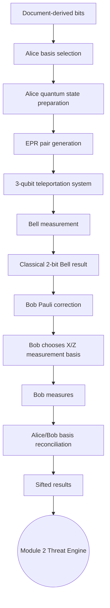
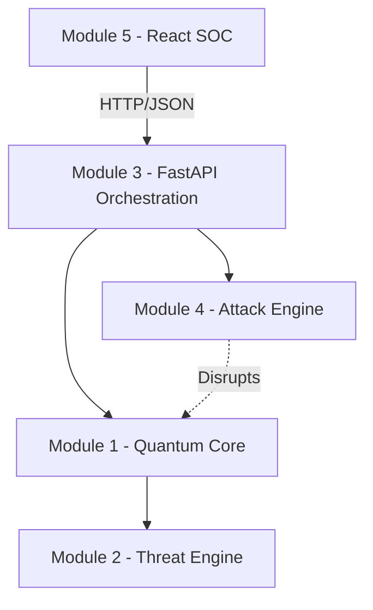

# Module 1 — Quantum Simulation Core

Module 1 is the foundational quantum simulation layer of the **Quantum-Inspired Cyber Threat Detection for Digital Signature Security** project. 

It leverages Qiskit and Qiskit Aer to simulate a fully functional quantum teleportation protocol. **Note:** This is a deterministic SIMULATION and PROTOTYPE of quantum behavior designed to model threat detection on a digital signature workflow. It does not interface with physical quantum hardware.

---

## 1. MODULE 1 RESPONSIBILITY

### What Module 1 Owns
Module 1 strictly owns the physics/simulation mechanics of the quantum protocol:
- EPR/Bell pair generation
- Alice's quantum signature-state preparation
- Teleportation circuit construction
- Bell measurement
- Classical Bell/feed-forward extraction
- Bob's Pauli correction
- Bob's X/Z projective measurement
- Basis reconciliation
- Sifting

### What Module 1 DOES NOT Own
The following responsibilities are out of scope for Module 1 and belong to other modules:
- QBER calculation (Module 2)
- XOR threat analysis (Module 2)
- Hoeffding threshold calculation (Module 2)
- CHSH threat analysis (Module 2)
- Final security decisions (Module 2)
- Attack simulation/noise injection (Module 4)
- FastAPI routes and endpoints (Module 3)
- PostgreSQL database persistence (Module 3)
- React/frontend SOC visualization (Module 5)

This strict decoupling ensures that changes to the Qiskit simulation do not break API integrations or statistical analyses.

---

## 2. HIGH-LEVEL QUANTUM FLOW



1. **Bits and Bases**: Alice takes classic bits and selects preparation bases (X or Z).
2. **State Prep**: Alice encodes her bits into quantum states on her signature qubit.
3. **EPR Distribution**: Entangled EPR pairs are created and shared between Alice and Bob.
4. **Teleportation**: Alice performs a joint Bell measurement on her signature qubit and her half of the EPR pair.
5. **Feed-Forward**: The 2-bit classical outcome dictates Bob's required Pauli correction.
6. **Correction & Measurement**: Bob applies the correction, chooses a measurement basis, and extracts his final bit.
7. **Sifting**: Alice and Bob discard results where their randomly chosen bases did not match.

---

## 3. QUANTUM STATE MODEL

The simulation explicitly preserves the joint quantum state for each pair to reflect realistic entanglement behavior. It utilizes a 3-qubit logical system:

- **`q0`** = Alice signature qubit
- **`q1`** = Alice's EPR half
- **`q2`** = Bob's EPR half

The implementation does NOT simulate EPR pairs as independently serialized Alice/Bob fragments. Instead, it evolves a single `QuantumCircuit` and tracks its `Statevector` mathematically from EPR preparation, through Alice's state insertion, up to the Bell measurement. Upon Bell measurement collapse, the statevector is preserved and passed to Bob for correction and final measurement.

---

## 4. EPR GENERATION
**File:** `backend/app/quantum/epr.py`

- **Purpose**: Creates requested quantities of simulated EPR pairs.
- **Bell State**: Initializes pairs in the standard `|Phi+> = (|00> + |11>) / sqrt(2)` state.
- **Circuit**: Conceptually applies an `H` gate to `q1` and a `CNOT` from `q1` to `q2`.
- **Tracking**: Generates a unified circuit resource per pair and ties it strongly to the provided `session_id` and assigned `pair_index`.

---

## 5. ALICE STATE PREPARATION
**File:** `backend/app/quantum/state_preparation.py`

Accepts an array of binary bits (0 or 1) and optional bases (X or Z). 
- **Z Basis Mapping**: `0 → |0>`, `1 → |1>`
- **X Basis Mapping**: `0 → |+>`, `1 → |->`

If explicit bases are not provided, it randomly generates them via standard Python `random` (which can be seeded deterministically for testing). The output provides structured `AliceState` internal records.

---

## 6. TELEPORTATION
**File:** `backend/app/quantum/teleportation.py`

Explicitly delineates the 3-qubit joint teleportation setup. It adds a barrier to the joint circuit, visually and logically separating the preparation phase (Alice's signature on `q0`, EPR on `q1` and `q2`) from the upcoming Bell measurement phase.

---

## 7. BELL MEASUREMENT
**File:** `backend/app/quantum/bell_measurement.py`

Executes the teleportation collapse:
- Applies `CNOT(q0, q1)` followed by `H(q0)`.
- Triggers a simulated measurement of `q0` and `q1` by extracting Qiskit's intermediate statevector.

**CRITICAL BIT-ORDER NORMALIZATION**:
Qiskit natively returns measurement strings in little-endian order (e.g., `sv.measure([0, 1])` returns a string where `q1` is the leftmost bit and `q0` is the rightmost bit). This module explicitly intercepts and normalizes this output into the project's public convention of `"b1b2"` (where `b1=q0` and `b2=q1`). It guarantees that downstream correction modules always receive `"00"`, `"01"`, `"10"`, or `"11"` reliably.

---

## 8. CLASSICAL FEED-FORWARD

The Bell measurement collapse yields a classical 2-bit string representing the outcome of Alice's local measurement. This information simulates classical transmission to Bob. 
**Note:** This is purely public feed-forward data for correction, NOT the secret key. Module 3 will eventually serialize this data through REST payloads.

The project correction mapping is defined as:
- `"00" → I`
- `"01" → X`
- `"10" → Z`
- `"11" → Y`

---

## 9. BOB PAULI CORRECTION
**File:** `backend/app/quantum/correction.py`

Centralizes the lookup logic against the canonical dictionary located in `constants.py`. Given the 2-bit Bell outcome, it applies the corresponding Pauli transformation (`X`, `Y`, `Z`, or `I`) strictly to Bob's qubit (`q2`), realigning the teleported state.

---

## 10. BOB MEASUREMENT
**File:** `backend/app/quantum/measurement.py`

Simulates Bob's final projective measurement:
- **Z Basis**: Measures computational basis directly.
- **X Basis**: Applies an `H` gate to `q2`, then measures.

It returns internal `BobMeasurement` records detailing `measurement_basis`, `measurement_result` (0 or 1), and optionally matches it against the `expected_bit` if provided. It does **NOT** calculate QBER or perform security thresholding.

---

## 11. BASIS SIFTING
**File:** `backend/app/quantum/sifting.py`

Reconciles Alice and Bob's bases.

**Example**:
- Alice: `Z X X Z X`
- Bob:   `Z X Z Z X`
- Result:`K K D K K` (Keep, Keep, Discard, Keep, Keep)

Outputs a list of `SiftRecord` dataclasses indicating `kept=True` where bases matched, paving the way for Module 2's security analytics.

---

## 12. FILE STRUCTURE

```text
backend/app/quantum/
    __init__.py             # Exports QuantumService
    constants.py            # Canonical correction dictionary
    errors.py               # QuantumSimulationError hierarchy
    models.py               # Internal domain dataclasses
    epr.py                  # Pair generation
    state_preparation.py    # Alice state encoding
    teleportation.py        # Circuit boundaries
    bell_measurement.py     # Alice measurement & normalization
    correction.py           # Bob Pauli correction
    measurement.py          # Bob final extraction
    sifting.py              # Basis reconciliation
    service.py              # QuantumService facade

backend/tests/quantum/
    __init__.py
    test_epr.py
    test_state_preparation.py
    test_teleportation.py
    test_bell_measurement.py
    test_correction.py
    test_measurement.py
    test_sifting.py
    test_service.py         # End-to-end integration and lineage checks
```

---

## 13. INTERNAL DATA MODELS
**File:** `models.py`

These are **INTERNAL MODULE 1 Python dataclasses**. They are **NOT** automatically public API/Pydantic models. Module 3 must map these into its own response schemas.

| Class | Fields | Purpose | Consumer |
|---|---|---|---|
| `EPRPair` | `session_id`, `pair_index`, `bell_state`, `circuit` | Holds joint Qiskit circuit | Module 1 internals |
| `AliceState` | `session_id`, `pair_index`, `private_bit`, `basis`, `state_label` | Alice's prepared configuration | Module 3 / Sifting |
| `BellMeasurement`| `session_id`, `pair_index`, `bell_result`, `correction_required` | Outcome of Alice's measurement | Module 3 / Correction |
| `BobMeasurement` | `session_id`, `pair_index`, `correction`, `measurement_basis`, `measurement_result`, `expected_bit`, `is_match` | Bob's extracted classical bits | Module 3 / Sifting |
| `SiftRecord` | `session_id`, `pair_index`, `alice_basis`, `bob_basis`, `basis_match`, `alice_bit`, `bob_bit`, `kept` | Basis alignment status | Module 3 / Module 2 |

---

## 14. ERROR HANDLING
**File:** `errors.py`

All errors extend `QuantumSimulationError`. Module 3 is responsible for translating these into appropriate HTTP responses (e.g. `400 Bad Request` for `InvalidBitSequence`).

- `InvalidBitSequence`: Bits were not 0/1 or length mismatched.
- `InvalidBasis`: Bases were not X/Z or length mismatched.
- `InvalidBellResult`: Unrecognized Bell string outcome.
- `EPRNotReady`: Resource missing.
- `MeasurementNotFound`: Missing dependency.
- `SiftingNotComplete`: Pre-mature access.
- `InternalError`: Unhandled Qiskit simulation crash.

---

## 15. QuantumService — MAIN INTEGRATION POINT
**File:** `service.py`

Module 3 **MUST** use `QuantumService` as the singular entry boundary.

```python
QuantumService.generate_epr(session_id: str, count: int) -> List[EPRPair]
QuantumService.prepare_signature(pairs: List[EPRPair], bits: List[int], bases: Optional[List[str]] = None) -> List[AliceState]
QuantumService.run_bell_measurement(pairs: List[EPRPair]) -> List[BellMeasurement]
QuantumService.apply_correction(pairs: List[EPRPair], bell_measurements: List[BellMeasurement]) -> None
QuantumService.measure(pairs: List[EPRPair], corrections: List[str], bases: Optional[List[str]] = None, expected_bits: Optional[List[int]] = None) -> List[BobMeasurement]
QuantumService.sift(alice_states: List[AliceState], bob_measurements: List[BobMeasurement]) -> List[SiftRecord]
```

These methods completely encapsulate Qiskit circuits and statevectors. Module 3 does not need to import Qiskit to use them.

---

## 16. HOW MODULE 3 SHOULD THINK ABOUT MODULE 1

1. **FastAPI endpoint** receives request.
2. Request validates via **Pydantic schema**.
3. Controller passes primitive data to **QuantumService**.
4. **QuantumService** runs simulation and returns an **internal dataclass**.
5. Module 3 controller converts dataclass into **Pydantic response schema**.
6. Sends **JSON** back to client.

**Module 3 does NOT directly manipulate Qiskit circuits, implement teleportation, apply corrections, or calculate QBER.**

---

## 17. SESSION_ID AND PAIR_INDEX

- **`session_id`** (e.g., `"sess-abc"`): Identifies the holistic transaction.
- **`pair_index`** (e.g., `0...19`): Uniquely tracks an individual EPR pair across its entire lifetime.

**Module 3 Warning**: Do NOT rely on simple array iteration indices (like `enumerate(list)`). Always persist and trust the explicit `pair_index` embedded inside `EPRPair`, `AliceState`, etc., to prevent misalignment when Module 4 later injects isolated pair attacks.

---

## 18. MODULE 1 → MODULE 2

Module 1 hands off raw quantum outcomes:
`SiftRecord` (containing Alice bit, Bob bit, kept status).

**Module 2** consumes this to perform:
- XOR mismatch detection
- QBER summation
- Hoeffding threshold checks
- Security decisions (Flag/Accept/Reject)

QBER and Hoeffding are **strictly isolated** from Module 1.

---

## 19. MODULE 1 → MODULE 4 (FUTURE INTEGRATION)

Module 4 will eventually act as the Adversary Attack Engine (Intercept-Resend, Forgery, PNS, Channel Noise). 

Module 4 will interact by modifying classical channel data (e.g., forging Bell bits before correction) or by interfering with the `pairs` resources before `run_bell_measurement`. Module 1 remains completely agnostic to these attacks; it just processes the quantum math natively as perturbed by Module 4.

---

## 20. MODULE 1 → MODULE 5

Module 5 (React Frontend SOC) has no direct knowledge of Module 1. All data sent to Module 5 is curated, formatted, and delivered by Module 3 APIs as clean JSON metrics (status, sifted counts, QBER, etc.).

---

## 21. WHAT MODULE 3 WILL EVENTUALLY ADD

(These components are **FUTURE** work and do not exist in Module 1):
- FastAPI routers (`/api/v1/quantum/...`)
- Pydantic models
- Session orchestration and Postgres logic via SQLAlchemy
- Security and telemetry middleware
- HTTP exception handling
- Swagger UI

---

## 22. API INTEGRATION CONCEPT (FUTURE)

*Conceptual example of how Module 3 will wrap Module 1 (these endpoints do NOT exist yet!)*:

```text
POST /api/v1/quantum/epr -> QuantumService.generate_epr() -> Pydantic response -> JSON
POST /api/v1/quantum/prepare -> QuantumService.prepare_signature() -> Pydantic response -> JSON
```

---

## 23. JSON BOUNDARY

**DO NOT serialize Qiskit internals**. 
Objects like `QuantumCircuit` and `Statevector` are strictly internal. Module 3 must peel away necessary metadata (`bell_state`, `pair_index`) from `models.py` dataclasses to format its JSON responses, ensuring Qiskit objects never leak into network responses.

---

## 24. TESTING

The test suite runs 20 unit and E2E integration tests natively in pytest. 
It ensures teleportation works flawlessly for all basis permutations (`|0>`, `|1>`, `|+>`, `|->`) and verifies strict `pair_index` lineage matching across `N=8` multi-pair scenarios.

Run tests using:
```bash
python -m pytest backend/tests/quantum
```

---

## 25. ⚠️ INTEGRATION RULES (DO NOT BREAK)

1. Do not rename `QuantumService` methods casually.
2. Do not change Bell-result conventions without refactoring the entire system.
3. Preserve the canonical mapping: `"00" → I`, `"01" → X`, `"10" → Z`, `"11" → Y`.
4. Preserve X/Z basis formatting.
5. Preserve 0/1 bit representation.
6. Preserve `session_id` and `pair_index` lineage exactly.
7. **Do not calculate QBER in Module 1.**
8. **Do not implement attacks in Module 1.**
9. **Do not make Module 1 depend on FastAPI.**
10. Do not expose Qiskit objects through APIs.
11. Do not use Module 1 dataclasses directly as final FastAPI routers/Pydantic schemas.
12. Do not introduce global mutable quantum state.

---

## 26. QUICK START FOR MODULE 3 DEVELOPER

If you're integrating this module, start here:
1. Read `MASTER_SPEC(1).md`.
2. Read this README completely.
3. Open `backend/app/quantum/service.py` to view the 6 integration functions.
4. Review `backend/app/quantum/models.py` to understand the input/output dataclasses.
5. Review `backend/tests/quantum/test_service.py` for a live E2E usage example.
6. Treat `QuantumService` as a black box—build Pydantic and FastAPI routes strictly around it.
7. Do not dive into Qiskit circuit manipulation unless you find a genuine simulation defect.

---

## 27. END-TO-END PROJECT MAP


